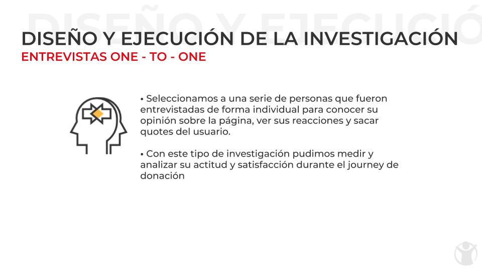
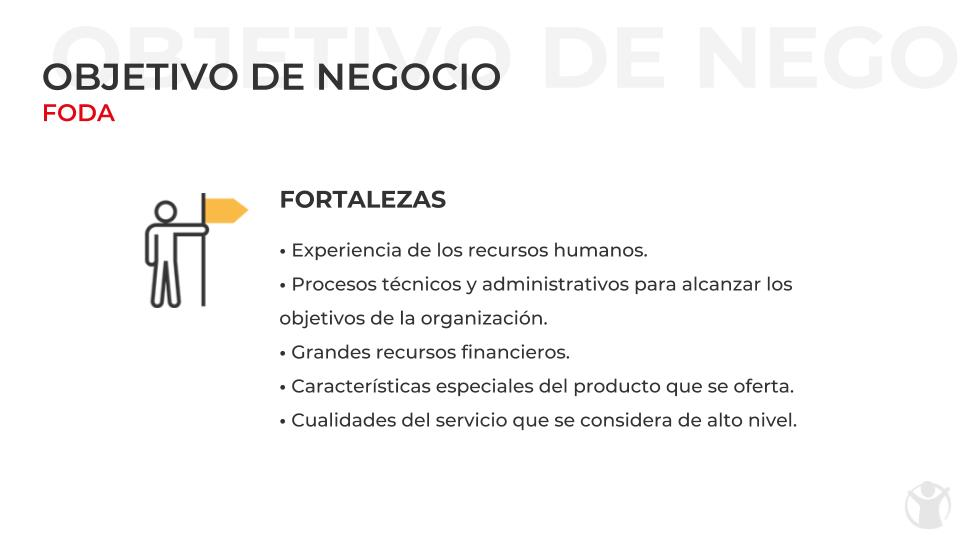
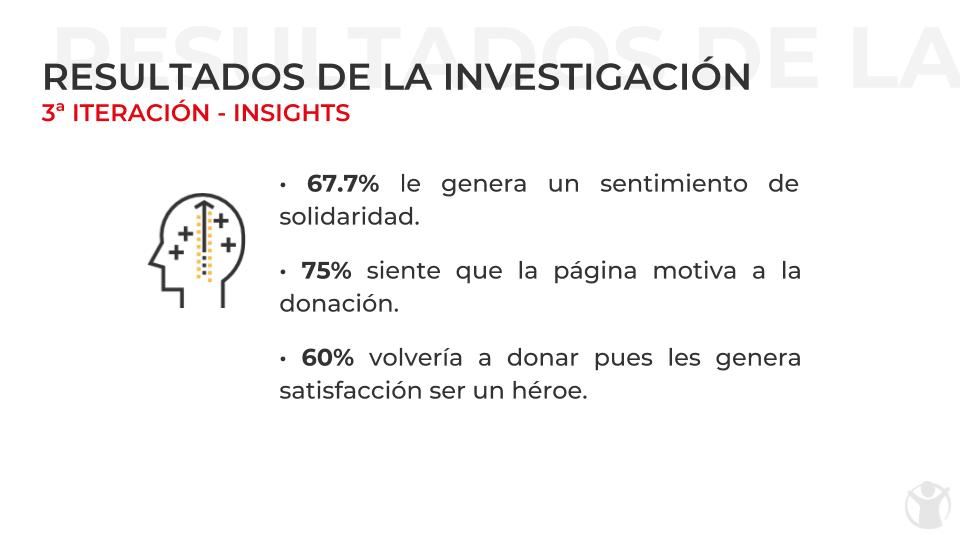

# SAVE THE CHILDREN

## **Empatizar**

¿Por qué cerca de 60,000 visitantes llegan a la página pero la abandonan sin convertirse en donantes? Para responder a esta pregunta primero revisamos a detalle la Landing Page de Save the children. Basandonos en este analisís  elaboramos una encuesta para conocer los pain-points de los usuarios

## **Definir**

### User persona

Usando los resultados de la encuesta y otros informes sobre donaciones y altruismo definimos a nuestro user persona y el mapa de empatía.

### Costumer Journey Map

El siguiente paso fue definir el journey del usuario al buscar la landing page.

### Analisís

Elaboramos una serie de analisis que nos pemitiera comprender de forma más profunda la problematica que enfrenta Save the Children (FODA, PESTEL, PARETO Y PEST)

## **Idear**

El siguiente paso fue definir los elementos de la solución.

## **Prototipar**

Posteriormente se desarrolló un prototipo que fué testeado con usuarios reales para saber si optimizaba su conversión a donantes

## **Testear**

Finalmente realizamos tres test sobre el desempeño de la página y descubrimos los beneficios que trajeron consigo las soluciones propuestas

## **Continuar creciendo**

Las siguientes son propuestas con las que nos gustaría continuar impulsando el crecimiento de donantes para Save the Children

### Integrantes:

Karina Mosqueda

Jessy Cuevas

Gaby Colín

Annet Trujillo Marín

Joy Esquivel

Lía Laguna
